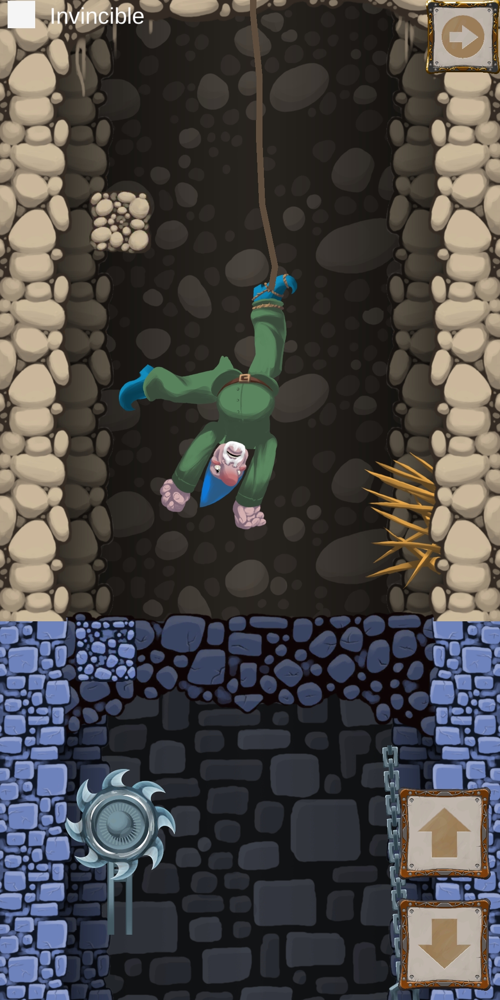

# RopeGnome
Повторение игры с гномом из книги O Riley Unity для разработчика. Мобильные мультиплатформенные игры. 2018г.

Веревку на которой держится гном можно удлинять или делать короче. 
Движение в стороны осуществляется через наклон телефона.
Необходимо спустится в колодец за сокровищем и унести его наверх, но будь осторожен! Путь содержит множество ловушек, не попадись на них.

